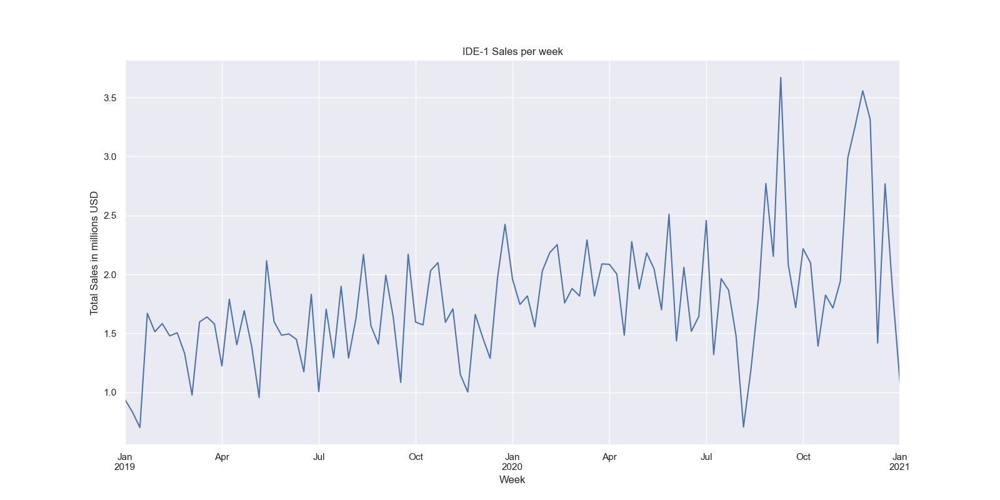
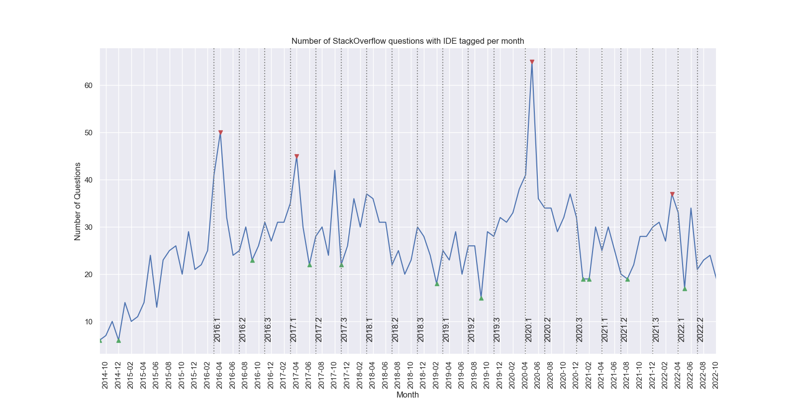
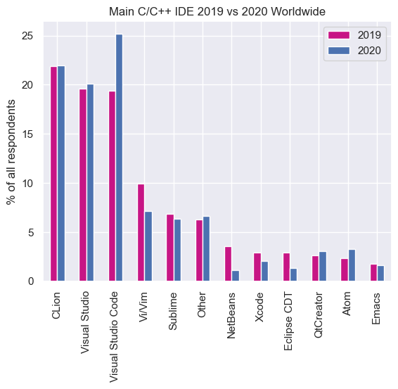
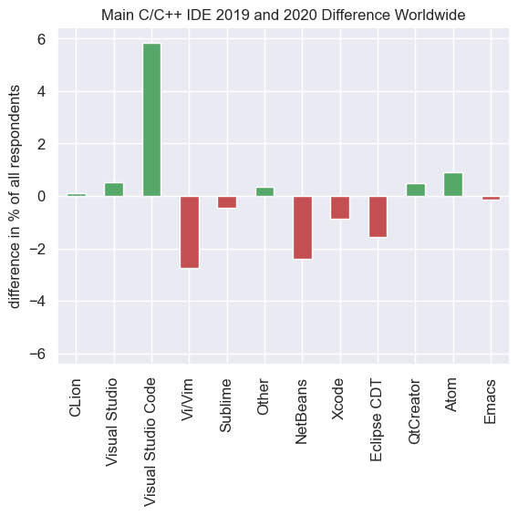
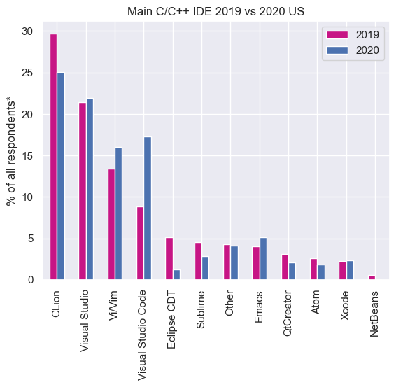
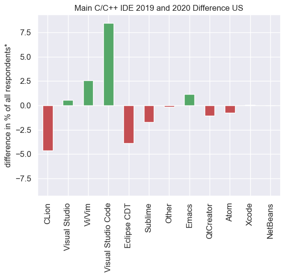
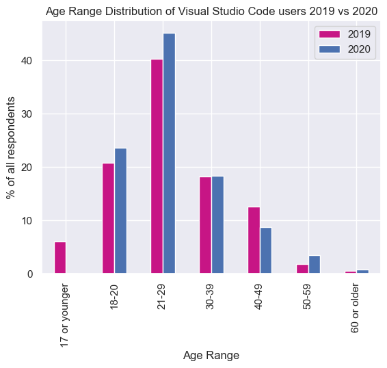
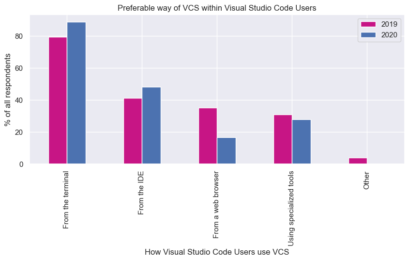
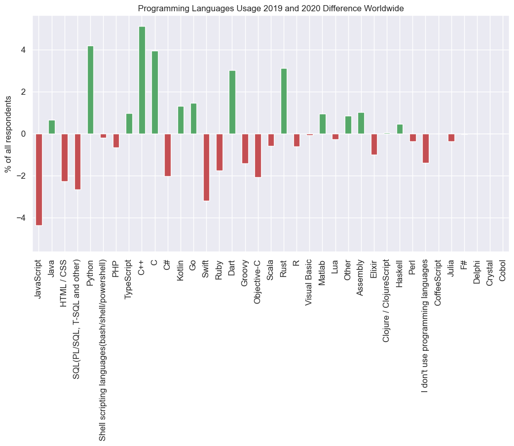

# Revenue IDE-1
## Revenue

(More details in **Sales Analysis.ipynb**)

Let's analyze the sales volume for the years 2019-2020.

|                     |   number of sales |   revenue in MM usd |
|:--------------------|------------------:|--------------------:|
| 2019, IDE-1         |             17823 |             79.9132 |
| 2019, IDE-3         |             17503 |             79.202  |
| 2019, IDE-2         |             17553 |             77.9747 |
| 2020, IDE-1         |             23478 |            106.124  |
| 2020, IDE-3         |             23601 |            106.104  |
| 2020, IDE-2         |             23098 |            102.606  |

Sales increased by 32.8% over the year.

Let's take a closer look at how the weekly revenue from IDE-1 sales changed over time.

    

The graph suggests an increasing trend and seasonality with a period of one year.

Using a simple ARIMA model, we can predict the expected revenue for 2021.

Expected revenue from IDE-1 sales for 2021:

|                   |   2021-01 |   2021-02 |   2021-03 |   2021-04 |   2021-05 |   2021-06 |   2021-07 |   2021-08 |   2021-09 |   2021-10 |   2021-11 |   2021-12 |
|:------------------|----------:|----------:|----------:|----------:|----------:|----------:|----------:|----------:|----------:|----------:|----------:|----------:|
| revenue in MM usd |   8.53728 |   8.39268 |   10.7757 |    8.6507 |   10.6236 |   8.67716 |   8.45593 |   10.6766 |   8.75607 |   8.38969 |   10.7488 |   8.66864 |

## What can be done?
- Improve the quality of the model by considering seasonality;
- Add parameters for model training (look at less aggregated data);
- Carefully analyze ACF and PACF graphs to identify dependencies with other periods. 
- Build a more robust model.

# Market Share of IDE-1

(More details in **Survey Analysis.ipynb**)

The main competitors of IDE-1 in the C++ developer IDE market (excluding other products from Company_Name):
- Visual Studio; 
- Eclipse CDT;
- XCode; 
- Code::Blocks; 
- CodeLite;
- Apache NetBeans; 
- Qt Creator.

The main competitors among text editors:
- Sublime Text;
- Atom; 
- Emacs;
- Vim.

It is important to note the following assumptions from which the analysis was conducted:
- We believe that the survey well represents the situation in the C++ developer market, but for correction, we take the population of countries worldwide and re-weight the result considering the distribution of people across different countries;
- We also believe that the percentage of developers in different countries is the same;
- It is assumed that IDE-1 is primarily used for development in C and C++ (although there is observed usage of Rust and Python).

# Analysis of IDE-1 User Behavior on StackOverflow

(More details in StackOverflow IDE-1 Questions Analysis.ipynb)

For the analysis, a dataset of 2628 questions was collected from StackOverflow tagged with IDE-1 from April 2019 to October 2022.

    

Three peaks in April 2016, April 2017, and April 2020 may be associated with the release of new major versions of IDE-1. 

Let's take a closer look at what users are asking about in questions tagged with IDE-1.

For the analysis, the titles of the questions were chosen, as they often contain concentrated information about the problem.

    

One of the most popular words found in questions about IDE-1 is cmake. Let's examine in what contexts it is used.

Semantic analysis using the LDA model allows us to identify the following categories of questions:
- General questions about using cmake in IDE-1 – a fairly expected category of questions;
- Issues with targets and libraries;
- Issues with detecting header files;
- Issues with syntax highlighting.

Examples of questions in each category:
|           | Title                                                      |
|:----------|:-----------------------------------------------------------|
| cmake     | How can I change MSVC compiler version in a CMAKE project? |
| target    | Target link Eigen library on IDE-1 fails                   |
| highlight | IDE-1 no syntax highlighting and hints for CMakeLists      |
| header    | IDE-1 doesnt recognize header files                        |

## What Questions Arise? 
- What can be changed in the product to reduce the frequency of users encountering issues with CMake?
- Can the experience of interacting with targets be simplified?
- Where and when exactly do issues with header detection arise? At the compilation stage, during code writing?
- Are syntax highlighting issues present all the time or only in certain scenarios?

# How Has the Popularity of VSCode Changed?

Let's compare 2019 and 2020. Looking closely at the difference, we see that CLion and Atom are gaining popularity, with CLion maintaining its position. Meanwhile, in the United States, IDE-1 has seen a decrease in usage, while VSCode has grown in popularity. CLion, Visual Studio, and VSCode are competing with each other.

| Main C/C++ IDE Worldwide| Difference between 2019 and 2020 |
|-------------------------|---------------------------------|
|||

| Main C/C++ IDE US| Difference between 2019 and 2020|
|------------------|---------------------------------|
|||

The age distribution of VSCode users has not changed significantly over the year, but there are more people aged 18-29.

    

## Trends Among C++ Developers
Let's see if anything has changed in the use of VSCode for version control.

    

As seen in the graph above, developers have increasingly used the terminal for version control and less frequently used browsers. VSCode is used more often.

## Popularity of C/C++
In the graph below, we see that C/C++ usage has increased by 4%.

    

